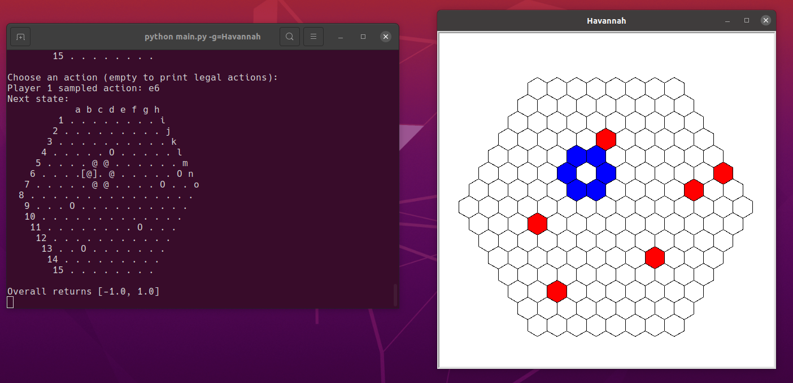
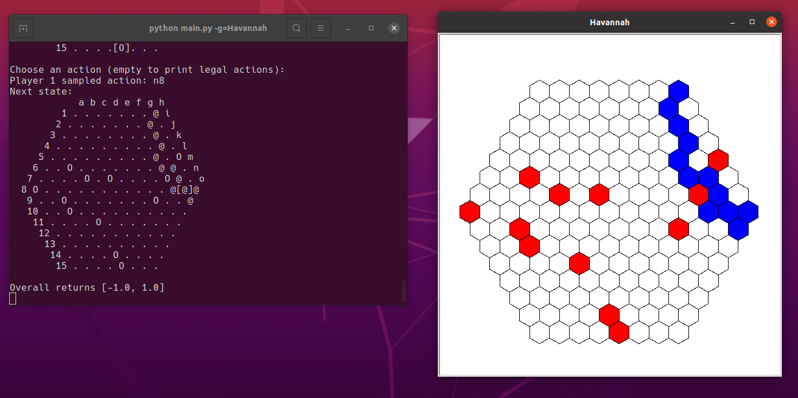

# 大作业

## 小组成员

PB20111696  王琛
PB20111697  王骥扬
PB20111699  吴骏东

## 项目介绍

借鉴[Free Python Games](https://github.com/grantjenks/free-python-games)使用turtle构建游戏界面，使用开源[open_spiel](https://github.com/deepmind/open_spiel)平台的游戏AI，加入[speech_recognition](https://github.com/Uberi/speech_recognition)的语音识别辅助游戏输入，支持[Tictactoe](https://en.wikipedia.org/wiki/Tic-tac-toe) [Go](https://en.wikipedia.org/wiki/Go_(game)) [Y](https://en.wikipedia.org/wiki/Y_(game)) [Hex](https://en.wikipedia.org/wiki/Hex_(board_game)) [Havannah](https://en.wikipedia.org/wiki/Havannah)五种游戏

## 环境配置

Ubuntu 20.04.4 LTS

conda 4.13.0

执行`conda create -n openspiel python=3.9`创建python3.9环境

执行`conda activate openspiel`激活环境

执行`pip install open_spiel`安装open_spiel

从github clone [speech_recognition](https://github.com/Uberi/speech_recognition)项目

在clone的项目下执行`python setup.py install`安装speech-recognition

执行` sudo apt-get install libasound-dev portaudio19-dev libportaudio2 libportaudiocpp0`安装PyAudio的依赖

执行`pip install PyAudio Vosk ` 安装speech-recognition所需库

参考版本如下

open-spiel                   1.0.2

PyAudio             0.2.11

vosk                0.3.42

下载vosk的中文[model](https://alphacephei.com/vosk/models)并解压于根目录model文件夹下，参考模型为[vosk-model-cn-0.22](https://alphacephei.com/vosk/models/vosk-model-cn-0.22.zip)

## 输入输出

在根目录下执行python main.py -h 查看命令行参数说明

```bash
usage: main.py [-h] [-g GAME] [-t TYPE] [-s SIMULATIONS]

Free_Python_Game & Open_Spiel & Speech_Recognition

optional arguments:
  -h, --help            show this help message and exit
  -g GAME, --game GAME  game name: Tictactoe, Go, Y, Hex, Havannah
  -t TYPE, --type TYPE  mouse or voice
  -s SIMULATIONS, --simulations SIMULATIONS
                        How many iterations of MCTS to perform
```

使用-g 指定游戏名称，使用-t 指定输入类型（mouse或voice），使用-s 指定蒙特卡洛迭代次数

三个参数均为可选，-g 默认为Tictactoe，-t 默认为mouse，-s 默认为 1000

例如 python main.py -g=Go 即可启动Go游戏

游戏中均为ai先手，第一步可能需要等待一段时间

## 功能介绍

### 命令行参数解析

使用argparse实现命令行参数的解析，可用的命令行参数有游戏名称（['Tictactoe', 'Go', 'Y', 'Hex', 'Havannah']）、输入方式（鼠标或语音）、蒙特卡洛算法迭代次数（次数越高ai水平越高，消耗时间随迭代次数线性增长）

```python
import argparse
from Tictactoe import Tictactoe
from Go import Go
from Y import Y
from Hex import Hex
from Havannah import Havannah


def main():
    parser = argparse.ArgumentParser(
        description="Free_Python_Game & Open_Spiel & Speech_Recognition")
    parser.add_argument('-g', '--game', default='Tictactoe', help='game name')
    parser.add_argument('-t', '--type', default='mouse', help='mouse or voice')
    parser.add_argument('-s', '--simulations', default=1000,
                        help='How many iterations of MCTS to perform')
    args = parser.parse_args()
    game_list = ['Tictactoe', 'Go', 'Y', 'Hex', 'Havannah']
    if not args.game in game_list:
        print(game_list)
        exit(-1)
    if args.game == 'Tictactoe':
        Tictactoe(args.type, int(args.simulations))
    elif args.game == 'Go':
        Go(args.type, int(args.simulations))
    elif args.game == 'Y':
        Y(args.type, int(args.simulations))
    elif args.game == 'Hex':
        Hex(args.type, int(args.simulations))
    elif args.game == 'Havannah':
        Havannah(args.type, int(args.simulations))


if __name__ == '__main__':
    main()
```

### 蒙特卡洛算法（开源）

```python
# Copyright 2019 DeepMind Technologies Ltd. All rights reserved.
#
# Licensed under the Apache License, Version 2.0 (the "License");
# you may not use this file except in compliance with the License.
# You may obtain a copy of the License at
#
#     http://www.apache.org/licenses/LICENSE-2.0
#
# Unless required by applicable law or agreed to in writing, software
# distributed under the License is distributed on an "AS IS" BASIS,
# WITHOUT WARRANTIES OR CONDITIONS OF ANY KIND, either express or implied.
# See the License for the specific language governing permissions and
# limitations under the License.

"""Monte-Carlo Tree Search algorithm for game play."""

from __future__ import absolute_import
from __future__ import division
from __future__ import print_function

import math
import time

import numpy as np

import pyspiel


class Evaluator(object):
  """Abstract class representing an evaluation function for a game.

  The evaluation function takes in an intermediate state in the game and returns
  an evaluation of that state, which should correlate with chances of winning
  the game. It returns the evaluation from all player's perspectives.
  """

  def evaluate(self, state):
    """Returns evaluation on given state."""
    raise NotImplementedError

  def prior(self, state):
    """Returns a probability for each legal action in the given state."""
    raise NotImplementedError


class RandomRolloutEvaluator(Evaluator):
  """A simple evaluator doing random rollouts.

  This evaluator returns the average outcome of playing random actions from the
  given state until the end of the game.  n_rollouts is the number of random
  outcomes to be considered.
  """

  def __init__(self, n_rollouts=1, random_state=None):
    self.n_rollouts = n_rollouts
    self._random_state = random_state or np.random.RandomState()

  def evaluate(self, state):
    """Returns evaluation on given state."""
    result = None
    for _ in range(self.n_rollouts):
      working_state = state.clone()
      while not working_state.is_terminal():
        if working_state.is_chance_node():
          outcomes = working_state.chance_outcomes()
          action_list, prob_list = zip(*outcomes)
          action = self._random_state.choice(action_list, p=prob_list)
        else:
          action = self._random_state.choice(working_state.legal_actions())
        working_state.apply_action(action)
      returns = np.array(working_state.returns())
      result = returns if result is None else result + returns

    return result / self.n_rollouts

  def prior(self, state):
    """Returns equal probability for all actions."""
    if state.is_chance_node():
      return state.chance_outcomes()
    else:
      legal_actions = state.legal_actions(state.current_player())
      return [(action, 1.0 / len(legal_actions)) for action in legal_actions]


class SearchNode(object):
  """A node in the search tree.

  A SearchNode represents a state and possible continuations from it. Each child
  represents a possible action, and the expected result from doing so.

  Attributes:
    action: The action from the parent node's perspective. Not important for the
      root node, as the actions that lead to it are in the past.
    player: Which player made this action.
    prior: A prior probability for how likely this action will be selected.
    explore_count: How many times this node was explored.
    total_reward: The sum of rewards of rollouts through this node, from the
      parent node's perspective. The average reward of this node is
      `total_reward / explore_count`
    outcome: The rewards for all players if this is a terminal node or the
      subtree has been proven, otherwise None.
    children: A list of SearchNodes representing the possible actions from this
      node, along with their expected rewards.
  """
  __slots__ = [
      "action",
      "player",
      "prior",
      "explore_count",
      "total_reward",
      "outcome",
      "children",
  ]

  def __init__(self, action, player, prior):
    self.action = action
    self.player = player
    self.prior = prior
    self.explore_count = 0
    self.total_reward = 0.0
    self.outcome = None
    self.children = []

  def uct_value(self, parent_explore_count, uct_c):
    """Returns the UCT value of child."""
    if self.outcome is not None:
      return self.outcome[self.player]

    if self.explore_count == 0:
      return float("inf")

    return self.total_reward / self.explore_count + uct_c * math.sqrt(
        math.log(parent_explore_count) / self.explore_count)

  def puct_value(self, parent_explore_count, uct_c):
    """Returns the PUCT value of child."""
    if self.outcome is not None:
      return self.outcome[self.player]

    return ((self.explore_count and self.total_reward / self.explore_count) +
            uct_c * self.prior * math.sqrt(parent_explore_count) /
            (self.explore_count + 1))

  def sort_key(self):
    """Returns the best action from this node, either proven or most visited.

    This ordering leads to choosing:
    - Highest proven score > 0 over anything else, including a promising but
      unproven action.
    - A proven draw only if it has higher exploration than others that are
      uncertain, or the others are losses.
    - Uncertain action with most exploration over loss of any difficulty
    - Hardest loss if everything is a loss
    - Highest expected reward if explore counts are equal (unlikely).
    - Longest win, if multiple are proven (unlikely due to early stopping).
    """
    return (0 if self.outcome is None else self.outcome[self.player],
            self.explore_count, self.total_reward)

  def best_child(self):
    """Returns the best child in order of the sort key."""
    return max(self.children, key=SearchNode.sort_key)

  def children_str(self, state=None):
    """Returns the string representation of this node's children.

    They are ordered based on the sort key, so order of being chosen to play.

    Args:
      state: A `pyspiel.State` object, to be used to convert the action id into
        a human readable format. If None, the action integer id is used.
    """
    return "\n".join([
        c.to_str(state)
        for c in reversed(sorted(self.children, key=SearchNode.sort_key))
    ])

  def to_str(self, state=None):
    """Returns the string representation of this node.

    Args:
      state: A `pyspiel.State` object, to be used to convert the action id into
        a human readable format. If None, the action integer id is used.
    """
    action = (
        state.action_to_string(state.current_player(), self.action)
        if state and self.action is not None else str(self.action))
    return ("{:>6}: player: {}, prior: {:5.3f}, value: {:6.3f}, sims: {:5d}, "
            "outcome: {}, {:3d} children").format(
                action, self.player, self.prior, self.explore_count and
                self.total_reward / self.explore_count, self.explore_count,
                ("{:4.1f}".format(self.outcome[self.player])
                 if self.outcome else "none"), len(self.children))

  def __str__(self):
    return self.to_str(None)


class MCTSBot(pyspiel.Bot):
  """Bot that uses Monte-Carlo Tree Search algorithm."""

  def __init__(self,
               game,
               uct_c,
               max_simulations,
               evaluator,
               solve=True,
               random_state=None,
               child_selection_fn=SearchNode.uct_value,
               dirichlet_noise=None,
               verbose=False):
    """Initializes a MCTS Search algorithm in the form of a bot.

    In multiplayer games, or non-zero-sum games, the players will play the
    greedy strategy.

    Args:
      game: A pyspiel.Game to play.
      uct_c: The exploration constant for UCT.
      max_simulations: How many iterations of MCTS to perform. Each simulation
        will result in one call to the evaluator. Memory usage should grow
        linearly with simulations * branching factor. How many nodes in the
        search tree should be evaluated. This is correlated with memory size and
        tree depth.
      evaluator: A `Evaluator` object to use to evaluate a leaf node.
      solve: Whether to back up solved states.
      random_state: An optional numpy RandomState to make it deterministic.
      child_selection_fn: A function to select the child in the descent phase.
        The default is UCT.
      dirichlet_noise: A tuple of (epsilon, alpha) for adding dirichlet noise to
        the policy at the root. This is from the alpha-zero paper.
      verbose: Whether to print information about the search tree before
        returning the action. Useful for confirming the search is working
        sensibly.

    Raises:
      ValueError: if the game type isn't supported.
    """
    pyspiel.Bot.__init__(self)
    # Check that the game satisfies the conditions for this MCTS implemention.
    game_type = game.get_type()
    if game_type.reward_model != pyspiel.GameType.RewardModel.TERMINAL:
      raise ValueError("Game must have terminal rewards.")
    if game_type.dynamics != pyspiel.GameType.Dynamics.SEQUENTIAL:
      raise ValueError("Game must have sequential turns.")

    self._game = game
    self.uct_c = uct_c
    self.max_simulations = max_simulations
    self.evaluator = evaluator
    self.verbose = verbose
    self.solve = solve
    self.max_utility = game.max_utility()
    self._dirichlet_noise = dirichlet_noise
    self._random_state = random_state or np.random.RandomState()
    self._child_selection_fn = child_selection_fn

  def restart_at(self, state):
    pass

  def step_with_policy(self, state):
    """Returns bot's policy and action at given state."""
    t1 = time.time()
    root = self.mcts_search(state)

    best = root.best_child()

    if self.verbose:
      seconds = time.time() - t1
      print("Finished {} sims in {:.3f} secs, {:.1f} sims/s".format(
          root.explore_count, seconds, root.explore_count / seconds))
      print("Root:")
      print(root.to_str(state))
      print("Children:")
      print(root.children_str(state))
      if best.children:
        chosen_state = state.clone()
        chosen_state.apply_action(best.action)
        print("Children of chosen:")
        print(best.children_str(chosen_state))

    mcts_action = best.action

    policy = [(action, (1.0 if action == mcts_action else 0.0))
              for action in state.legal_actions(state.current_player())]

    return policy, mcts_action

  def step(self, state, str):
    return self.step_with_policy(state)[1]

  def _apply_tree_policy(self, root, state):
    """Applies the UCT policy to play the game until reaching a leaf node.

    A leaf node is defined as a node that is terminal or has not been evaluated
    yet. If it reaches a node that has been evaluated before but hasn't been
    expanded, then expand it's children and continue.

    Args:
      root: The root node in the search tree.
      state: The state of the game at the root node.

    Returns:
      visit_path: A list of nodes descending from the root node to a leaf node.
      working_state: The state of the game at the leaf node.
    """
    visit_path = [root]
    working_state = state.clone()
    current_node = root
    while not working_state.is_terminal() and current_node.explore_count > 0:
      if not current_node.children:
        # For a new node, initialize its state, then choose a child as normal.
        legal_actions = self.evaluator.prior(working_state)
        if current_node is root and self._dirichlet_noise:
          epsilon, alpha = self._dirichlet_noise
          noise = self._random_state.dirichlet([alpha] * len(legal_actions))
          legal_actions = [(a, (1 - epsilon) * p + epsilon * n)
                           for (a, p), n in zip(legal_actions, noise)]
        # Reduce bias from move generation order.
        self._random_state.shuffle(legal_actions)
        player = working_state.current_player()
        current_node.children = [
            SearchNode(action, player, prior) for action, prior in legal_actions
        ]

      if working_state.is_chance_node():
        # For chance nodes, rollout according to chance node's probability
        # distribution
        outcomes = working_state.chance_outcomes()
        action_list, prob_list = zip(*outcomes)
        action = self._random_state.choice(action_list, p=prob_list)
        chosen_child = next(
            c for c in current_node.children if c.action == action)
      else:
        # Otherwise choose node with largest UCT value
        chosen_child = max(
            current_node.children,
            key=lambda c: self._child_selection_fn(  # pylint: disable=g-long-lambda
                c, current_node.explore_count, self.uct_c))

      working_state.apply_action(chosen_child.action)
      current_node = chosen_child
      visit_path.append(current_node)

    return visit_path, working_state

  def mcts_search(self, state):
    """A vanilla Monte-Carlo Tree Search algorithm.

    This algorithm searches the game tree from the given state.
    At the leaf, the evaluator is called if the game state is not terminal.
    A total of max_simulations states are explored.

    At every node, the algorithm chooses the action with the highest PUCT value,
    defined as: `Q/N + c * prior * sqrt(parent_N) / N`, where Q is the total
    reward after the action, and N is the number of times the action was
    explored in this position. The input parameter c controls the balance
    between exploration and exploitation; higher values of c encourage
    exploration of under-explored nodes. Unseen actions are always explored
    first.

    At the end of the search, the chosen action is the action that has been
    explored most often. This is the action that is returned.

    This implementation supports sequential n-player games, with or without
    chance nodes. All players maximize their own reward and ignore the other
    players' rewards. This corresponds to max^n for n-player games. It is the
    norm for zero-sum games, but doesn't have any special handling for
    non-zero-sum games. It doesn't have any special handling for imperfect
    information games.

    The implementation also supports backing up solved states, i.e. MCTS-Solver.
    The implementation is general in that it is based on a max^n backup (each
    player greedily chooses their maximum among proven children values, or there
    exists one child whose proven value is game.max_utility()), so it will work
    for multiplayer, general-sum, and arbitrary payoff games (not just win/loss/
    draw games). Also chance nodes are considered proven only if all children
    have the same value.

    Some references:
    - Sturtevant, An Analysis of UCT in Multi-Player Games,  2008,
      https://web.cs.du.edu/~sturtevant/papers/multi-player_UCT.pdf
    - Nijssen, Monte-Carlo Tree Search for Multi-Player Games, 2013,
      https://project.dke.maastrichtuniversity.nl/games/files/phd/Nijssen_thesis.pdf
    - Silver, AlphaGo Zero: Starting from scratch, 2017
      https://deepmind.com/blog/article/alphago-zero-starting-scratch
    - Winands, Bjornsson, and Saito, "Monte-Carlo Tree Search Solver", 2008.
      https://dke.maastrichtuniversity.nl/m.winands/documents/uctloa.pdf

    Arguments:
      state: pyspiel.State object, state to search from

    Returns:
      The most visited move from the root node.
    """
    root_player = state.current_player()
    root = SearchNode(None, state.current_player(), 1)
    for _ in range(self.max_simulations):
      visit_path, working_state = self._apply_tree_policy(root, state)
      if working_state.is_terminal():
        returns = working_state.returns()
        visit_path[-1].outcome = returns
        solved = self.solve
      else:
        returns = self.evaluator.evaluate(working_state)
        solved = False

      for node in reversed(visit_path):
        node.total_reward += returns[root_player if node.player ==
                                     pyspiel.PlayerId.CHANCE else node.player]
        node.explore_count += 1

        if solved and node.children:
          player = node.children[0].player
          if player == pyspiel.PlayerId.CHANCE:
            # Only back up chance nodes if all have the same outcome.
            # An alternative would be to back up the weighted average of
            # outcomes if all children are solved, but that is less clear.
            outcome = node.children[0].outcome
            if (outcome is not None and
                all(np.array_equal(c.outcome, outcome) for c in node.children)):
              node.outcome = outcome
            else:
              solved = False
          else:
            # If any have max utility (won?), or all children are solved,
            # choose the one best for the player choosing.
            best = None
            all_solved = True
            for child in node.children:
              if child.outcome is None:
                all_solved = False
              elif best is None or child.outcome[player] > best.outcome[player]:
                best = child
            if (best is not None and
                (all_solved or best.outcome[player] == self.max_utility)):
              node.outcome = best.outcome
            else:
              solved = False
      if root.outcome is not None:
        break

    return root
```

### 人类bot

这部分为open_spiel所用的人类bot，修改了其中输入的部分，使其可以响应鼠标和语音输入。若选择鼠标输入，当鼠标点击时主动向bot传递参数。若选择语音输入，让bot向语音输入发出请求

```python
# Copyright 2019 DeepMind Technologies Ltd. All rights reserved.
#
# Licensed under the Apache License, Version 2.0 (the "License");
# you may not use this file except in compliance with the License.
# You may obtain a copy of the License at
#
#     http://www.apache.org/licenses/LICENSE-2.0
#
# Unless required by applicable law or agreed to in writing, software
# distributed under the License is distributed on an "AS IS" BASIS,
# WITHOUT WARRANTIES OR CONDITIONS OF ANY KIND, either express or implied.
# See the License for the specific language governing permissions and
# limitations under the License.

"""A bot that asks the user which action to play."""

from __future__ import absolute_import
from __future__ import division
from __future__ import print_function

import math
import os

import pyspiel
from microphone_recognition import recognition

_MAX_WIDTH = int(os.getenv("COLUMNS", 80))  # Get your TTY width.


def _print_columns(strings):
    """Prints a list of strings in columns."""
    padding = 2
    longest = max(len(s) for s in strings)
    max_columns = math.floor((_MAX_WIDTH - 1) / (longest + 2 * padding))
    rows = math.ceil(len(strings) / max_columns)
    columns = math.ceil(len(strings) / rows)  # Might not fill all max_columns.
    for r in range(rows):
        for c in range(columns):
            i = r + c * rows
            if i < len(strings):
                print(" " * padding +
                      strings[i].ljust(longest + padding), end="")
        print()


class HumanBot(pyspiel.Bot):
    """Asks the user which action to play."""

    def __init__(self, type) -> None:
        super().__init__()
        self.type = type

    def step_with_policy(self, state, str):
        """Returns the stochastic policy and selected action in the given state."""
        legal_actions = state.legal_actions(state.current_player())
        if not legal_actions:
            return [], pyspiel.INVALID_ACTION
        p = 1 / len(legal_actions)
        policy = [(action, p) for action in legal_actions]

        action_map = {
            state.action_to_string(state.current_player(), action): action
            for action in legal_actions
        }

        while True:
            print("Choose an action (empty to print legal actions): ")
            if self.type == 'mouse':
                action_str = str
            else:
                action_str = recognition()
            if not action_str:
                print("Legal actions(s):")
                longest_num = max(len(str(action)) for action in legal_actions)
                _print_columns([
                    "{}: {}".format(str(action).rjust(longest_num), action_str)
                    for action_str, action in sorted(action_map.items())
                ])
                continue

            if action_str in action_map:
                return policy, action_map[action_str]

            try:
                action = int(action_str)
            except ValueError:
                print("Could not parse the action:", action_str)
                continue

            if action in legal_actions:
                return policy, action

            print("Illegal action selected:", action_str)

    def step(self, state, str):
        return self.step_with_policy(state, str)[1]

    def restart_at(self, state):
        pass
```

### 语音输入

调用speech_recognition实现语音输入，选用的模型为中文模型，对得到的模型输出进行字符串解析转化为数字并传递给bot，在结果不符合要求时bot会再次请求语音输入

```python
import speech_recognition as sr


def find(target):
    list = ['一', '二', '三', '四', '五', '六', '七', '八', '九', '十']
    for index, value in enumerate(list):
        if value == target:
            return index + 1
    return None


def convert(result):
    result = (str(str(result.split('"text" : ')[1]).split('"')[1])).split(' ')
    if len(result) == 1:
        return find(result[0])
    elif len(result) == 2:
        if result[0] == '十':
            return 10 + find(result[1])
        elif result[1] == '十':
            return find(result[0]) * 10
        elif result[1] == '百':
            return find(result[0]) * 100
    elif len(result) == 3:
        if result[1] == '十':
            return find(result[0]) * 10 + find(result[2])
    elif len(result) == 4:
        if result[1] == '百' and result[2] == '零':
            return find(result[0]) * 100 + find(result[3])
        if result[1] == '百' and result[3] == '十':
            return find(result[0]) * 100 + find(result[2])*10
    elif len(result) == 5:
        if result[1] == '百' and result[3] == '十':
            return find(result[0]) * 100 + find(result[2])*10 + find(result[4])
    return 'error'


def recognition():
    # obtain audio from the microphone
    r = sr.Recognizer()
    with sr.Microphone() as source:
        print("Say something!")
        audio = r.listen(source)

    # recognize speech using Vosk
    try:
        result = convert(r.recognize_vosk(audio))
        print(result)
        return str(result)
    except sr.UnknownValueError:
        print("Vosk could not understand audio")
    except sr.RequestError as e:
        print("Vosk error; {0}".format(e))
```

### Game类的实现

Game类是五种游戏的基类，通过调用open_spiel库实现了游戏状态与游戏ai的初始化，游戏的进行与结果的判断

```python
from __future__ import absolute_import
from __future__ import division
from __future__ import print_function

import numpy as np

from openspiel.python.algorithms import mcts
from openspiel.python.bots import human
import pyspiel


class Game():
    def __init__(self, name, show, type='mouse', simulations=1000) -> None:
        self.game = pyspiel.load_game(name)
        self.type = type
        self.bots = [
            self.init_bot('mcts', self.game, simulations),
            self.init_bot('human', self.game),
        ]
        self.state = self.game.new_initial_state()
        self.show = show
        self.init_game()

    def init_bot(self, bot_type, game, simulations=1000):
        """Initializes a bot by type."""
        rng = np.random.RandomState(None)
        if bot_type == "mcts":
            evaluator = mcts.RandomRolloutEvaluator(1, rng)
            return mcts.MCTSBot(
                game,
                2,
                simulations,
                evaluator,
                random_state=rng,
                solve=True,
                verbose=False)
        if bot_type == "human":
            return human.HumanBot(self.type)
        raise ValueError("Invalid bot type: %s" % bot_type)

    def init_game(self):
        print("Initial state:\n{}".format(self.state))
        self.show(str(self.state))
        self.play_game()

    def play_game(self, position=None):
        if self.state.is_terminal():
            return
        current_player = self.state.current_player()
        bot = self.bots[current_player]
        action = bot.step(self.state, position)
        action_str = self.state.action_to_string(current_player, action)
        print("Player {} sampled action: {}".format(
            current_player, action_str))

        for i, bot in enumerate(self.bots):
            if i != current_player:
                bot.inform_action(self.state, current_player, action)
        self.state.apply_action(action)

        print("Next state:\n{}".format(self.state))
        self.show(str(self.state))

        if self.state.is_terminal():
            overall_returns = [0, 0]
            for i, v in enumerate(self.state.returns()):
                overall_returns[i] += v
            print("Overall returns", overall_returns)
```

### 游戏类

以下五个游戏类的基类为Game，采用turtle库实现游戏界面，在基类的基础上根据不同的游戏设定了窗体大小，增加了grid、draw_black、draw_white、floor、draw、show、tap、_state、players、arr成员，它们的作用如下

- grid 绘制游戏棋盘
- draw_black、draw_white 绘制游戏双方的棋子
- floor 对鼠标点击的坐标进行取整
- draw 绘制棋子
- tap 响应鼠标点击
- _state 存储当前游戏方信息
- players 用于棋子绘制
- arr 保存当前盘面信息，防止在同一处再次落子

#### Tictactoe

井字棋由两名玩家轮流在 3×3 棋盘中标记空格为X或O。成功将三个标记放置在水平、垂直或对角线中的玩家为获胜者。


```python
import turtle
from Game import Game


class Tictactoe(Game):
    def __init__(self, type='mouse', simulations=1000) -> None:
        self._state = {'player': 0}
        self.players = [self.drawx, self.drawo]
        self.arr = [[0 for i in range(3)] for j in range(3)]
        turtle.setup(420, 420)
        turtle.title('Tictactoe')
        turtle.hideturtle()
        turtle.tracer(False)
        self.grid()
        super().__init__('tic_tac_toe', self.show, type, simulations)
        if type == 'mouse':
            turtle.onscreenclick(self.tap)
        else:
            while not self.state.is_terminal():
                self.play_game()
        turtle.done()

    def line(self, a, b, x, y):
        turtle.up()
        turtle.goto(a, b)
        turtle.down()
        turtle.goto(x, y)

    def grid(self):
        self.line(-67, 200, -67, -200)
        self.line(67, 200, 67, -200)
        self.line(-200, -67, 200, -67)
        self.line(-200, 67, 200, 67)
        turtle.update()

    def drawx(self, x, y):
        self.line(x, y, x + 133, y + 133)
        self.line(x, y + 133, x + 133, y)
        turtle.update()

    def drawo(self, x, y):
        turtle.up()
        turtle.goto(x + 67, y + 5)
        turtle.down()
        turtle.circle(62)
        turtle.update()

    def floor(self, value):
        return ((value + 200) // 133) * 133 - 200

    def draw(self, x, y):
        """Draw X or O in tapped square."""
        x = self.floor(x)
        y = self.floor(y)
        player = self._state['player']
        draw = self.players[player]
        draw(x, y)
        turtle.update()
        self._state['player'] = not player

    def show(self, str):
        self.arr = [[0 for i in range(3)] for j in range(3)]
        str = str[:]
        turtle.clear()
        self.grid()
        for i in range(3):
            for j in range(3):
                if(str[i*4+j] != '.'):
                    self.arr[i][j] = 1
                    self._state['player'] = 0 if str[i*4+j] == 'x' else 1
                    self.draw(-133+j*133, 133-i*133)

    def tap(self, x, y):
        x = int((x + 200) // 133)
        y = int(2 - (y + 200) // 133)
        position = str(x + y*3)
        if self.arr[y][x] == 1:
            return
        for i in range(2):
            self.play_game(position)


if __name__ == "__main__":
    Tictactoe()
```

#### Go

围棋使用矩形格状棋盘及黑白二色圆形棋子进行对弈，正规棋盘上有纵横各19条线段，361个交叉点，棋子必须走在空格非禁着点的交叉点上，双方交替行棋，落子后不能移动或悔棋，以目数多者为胜。


```python
import turtle
from Game import Game


class Go(Game):
    def __init__(self, type='mouse', simulations=1000) -> None:
        self._state = {'player': 0}
        self.players = [self.draw_black, self.draw_white]
        self.arr = [[0 for i in range(19)] for j in range(19)]
        turtle.setup(760, 760)
        turtle.title('Go')
        turtle.hideturtle()
        turtle.tracer(False)
        self.grid()
        super().__init__('go', self.show, type, simulations)
        if type == 'mouse':
            turtle.onscreenclick(self.tap)
        else:
            while not self.state.is_terminal():
                self.play_game()
        turtle.done()

    def grid(self):
        turtle.home()
        for i in range(19):  # 画横向
            turtle.up()
            turtle.goto(-360, -360+i*40)
            turtle.down()
            turtle.fd(720)
        turtle.left(90)
        for i in range(19):  # 画竖向
            turtle.up()
            turtle.goto(-360+i*40, -360)
            turtle.down()
            turtle.fd(720)

        turtle.up()  # 画标点
        turtle.goto(0, 0)
        turtle.dot()
        turtle.goto(240, 240)
        turtle.dot()
        turtle.goto(-240, 240)
        turtle.dot()
        turtle.goto(240, -240)
        turtle.dot()
        turtle.goto(-240, -240)
        turtle.dot()
        turtle.update()

    def draw_black(self, x, y):
        turtle.goto(x, y)
        turtle.dot(20)

    def draw_white(self, x, y):
        turtle.goto(x+10, y)
        turtle.down()
        turtle.circle(10)
        turtle.up()

    def floor(self, value):
        return int(((value + 360) / 40) + 0.5) * 40 - 360

    def draw(self, x, y):
        x = self.floor(x)
        y = self.floor(y)
        player = self._state['player']
        draw = self.players[player]
        draw(x, y)
        turtle.update()
        self._state['player'] = not player

    def show(self, str):
        self.arr = [[0 for i in range(19)] for j in range(19)]
        str = str.split('\n')[2:21]
        turtle.clear()
        self.grid()
        i = 0
        for substr in str:
            j = 0
            for ch in substr:
                if ch == '+':
                    j += 1
                elif ch == 'X':
                    self.arr[i][j] = 1
                    self._state['player'] = 0
                    self.draw(-360+j*40, 360-i*40)
                    j += 1
                elif(ch == 'O'):
                    self.arr[i][j] = 1
                    self._state['player'] = 1
                    self.draw(-360+j*40, 360-i*40)
                    j += 1
            i += 1

    def tap(self, x, y):
        x = int(((x + 360) / 40) + 0.5)
        y = int(((y + 360) / 40) + 0.5)
        position = str(x + y*19)
        if self.arr[18 - y][x] == 1:
            return
        for i in range(2):
            self.play_game(position)


if __name__ == "__main__":
    Go()
```

#### Y

规则如下：

- 玩家轮流在棋盘上放置一颗他们颜色的棋子。
- 一旦玩家连接了棋盘的所有三个面，游戏就结束并且该玩家获胜。角点属于它们相邻的板的两侧。


```python
import turtle
from Game import Game


class Y(Game):
    def __init__(self, type='mouse', simulations=1000) -> None:
        self._state = {'player': 0}
        self.players = [self.draw_black, self.draw_white]
        self.arr = [[0 for i in range(19)] for j in range(19)]
        turtle.setup(700, 700)
        turtle.title('Y')
        turtle.hideturtle()
        turtle.tracer(False)
        self.grid()
        super().__init__('y', self.show, type, simulations)
        if type == 'mouse':
            turtle.onscreenclick(self.tap)
        else:
            while not self.state.is_terminal():
                self.play_game()
        turtle.done()

    def hexagon(self, x, y):
        turtle.penup()
        turtle.goto(x, y-20)
        turtle.pendown()
        turtle.circle(20, steps=6)

    def grid(self):
        for i in range(20):
            for j in range(i):
                self.hexagon(350+20/2*(3**0.5)*(j-2*i), 230-30*j)
        turtle.update()

    def draw_black(self, x, y):
        turtle.fillcolor('red')
        turtle.begin_fill()
        self.hexagon(x, y)
        turtle.end_fill()
        turtle.update()

    def draw_white(self, x, y):
        turtle.fillcolor('blue')
        turtle.begin_fill()
        self.hexagon(x, y)
        turtle.end_fill()
        turtle.update()

    def draw(self, x, y):
        player = self._state['player']
        draw = self.players[player]
        draw(x, y)
        self._state['player'] = not player

    def show(self, str):
        self.arr = [[0 for i in range(19)] for j in range(19)]
        str = str.split('\n')[1:20]
        turtle.clear()
        self.grid()
        i = 0
        for substr in str:
            j = 0
            for ch in substr:
                if ch == '.':
                    j += 1
                elif ch == 'O':
                    self.arr[i][j] = 1
                    self._state['player'] = 0
                    self.draw(350+20/2*(3**0.5)*(i-2*(19-j)), 230-30*i)
                    j += 1
                elif ch == '@':
                    self.arr[i][j] = 1
                    self._state['player'] = 1
                    self.draw(350+20/2*(3**0.5)*(i-2*(19-j)), 230-30*i)
                    j += 1
            i += 1

    def tap(self, x, y):
        for i in range(20):
            for j in range(i):
                X = 350+20/2*(3**0.5)*(j-2*i)
                Y = 230-30*j
                if x >= X - 20 and x <= X + 20 and y >= Y - 20 and y <= Y + 20:
                    if x >= X - 20 and x <= X:
                        if y > Y - 10 - 10 * (x - (X-20))/(10*(3**0.5)) and y < Y + 10 + 10 * (x - (X-20))/(10*(3**0.5)):
                            if self.arr[j][19-i] == 1:
                                return
                            position = str(19*j+19-i)
                            for i in range(2):
                                self.play_game(position)
                            return
                    elif x >= X and x <= X + 20:
                        if y > Y - 10 - 10 * ((X+20) - x)/(10*(3**0.5)) and y < Y + 10 + 10 * ((X+20) - x)/(10*(3**0.5)):
                            if self.arr[j][19-i] == 1:
                                return
                            position = str(19*j+19-i)
                            for i in range(2):
                                self.play_game(position)
                            return


if __name__ == "__main__":
    Y()
```

#### Hex

它传统上在 11×11菱形板上进行。每个玩家都被分配了一对相对的棋盘面，他们必须轮流将一块与他们颜色相同的棋子放在任何空白处，以尝试将它们连接起来。一旦放置，石头就无法移动或移除。当玩家通过一连串相邻的棋子成功地将相对的棋盘面连接在一起时获胜。由于游戏板的拓扑结构，在 Hex 中无法进行平局。


```python
import turtle
from Game import Game


class Hex(Game):
    def __init__(self, type='mouse', simulations=1000) -> None:
        self._state = {'player': 0}
        self.players = [self.draw_black, self.draw_white]
        self.arr = [[0 for i in range(11)] for j in range(11)]
        turtle.setup(600, 400)
        turtle.title('Hex')
        turtle.hideturtle()
        turtle.tracer(False)
        self.grid()
        super().__init__('hex', self.show, type, simulations)
        if type == 'mouse':
            turtle.onscreenclick(self.tap)
        else:
            while not self.state.is_terminal():
                self.play_game()
        turtle.done()

    def hexagon(self, x, y):
        turtle.penup()
        turtle.goto(x, y-20)
        turtle.pendown()
        turtle.circle(20, steps=6)

    def grid(self):
        for i in range(11):
            for j in range(11):
                self.hexagon(-250+20/2*(3**0.5)*(2*j+i), 150-30*i)
        turtle.update()

    def draw_black(self, x, y):
        turtle.fillcolor('red')
        turtle.begin_fill()
        self.hexagon(x, y)
        turtle.end_fill()
        turtle.update()

    def draw_white(self, x, y):
        turtle.fillcolor('blue')
        turtle.begin_fill()
        self.hexagon(x, y)
        turtle.end_fill()
        turtle.update()

    def draw(self, x, y):
        player = self._state['player']
        draw = self.players[player]
        draw(x, y)
        self._state['player'] = not player

    def show(self, str):
        self.arr = [[0 for i in range(11)] for j in range(11)]
        str = str.split('\n')
        turtle.clear()
        self.grid()
        i = 0
        for substr in str:
            j = 0
            for ch in substr:
                if ch == '.':
                    j += 1
                elif ch == 'x' or ch == 'y' or ch == 'z' or ch == 'X':
                    self.arr[i][j] = 1
                    self._state['player'] = 0
                    self.draw(-250+20/2*(3**0.5)*(2*j+i), 150-30*i)
                    j += 1
                elif ch == 'o' or ch == 'p' or ch == 'q' or ch == 'O':
                    self.arr[i][j] = 1
                    self._state['player'] = 1
                    self.draw(-250+20/2*(3**0.5)*(2*j+i), 150-30*i)
                    j += 1
            i += 1

    def tap(self, x, y):
        for i in range(11):
            for j in range(11):
                X = -250+20/2*(3**0.5)*(2*j+i)
                Y = 150-30*i
                if x >= X - 20 and x <= X + 20 and y >= Y - 20 and y <= Y + 20:
                    if x >= X - 20 and x <= X:
                        if y > Y - 10 - 10 * (x - (X-20))/(10*(3**0.5)) and y < Y + 10 + 10 * (x - (X-20))/(10*(3**0.5)):
                            if self.arr[i][j] == 1:
                                return
                            position = str(i*11+j)
                            for i in range(2):
                                self.play_game(position)
                            return
                    elif x >= X and x <= X + 20:
                        if y > Y - 10 - 10 * ((X+20) - x)/(10*(3**0.5)) and y < Y + 10 + 10 * ((X+20) - x)/(10*(3**0.5)):
                            if self.arr[i][j] == 1:
                                return
                            position = str(i*11+j)
                            for i in range(2):
                                self.play_game(position)
                            return


if __name__ == "__main__":
    Hex()
```

#### Havannah

规则如下：

- 每位玩家每回合将一颗与其颜色相同的棋子放在棋盘上。
- 棋子永远不会被移动、捕获或以其他方式改变。
- 当玩家完成三个不同结构中的一个时获胜：
  - 环，围绕一个或多个单元格的循环（无论被包围的单元格是否被任何玩家占据或空）；
  - 桥，连接棋盘六个角点中的任意两个；
  - 叉子，连接棋盘的任意三个边缘；角点不被视为边缘的一部分。






```python
import turtle
from Game import Game


class Havannah(Game):
    def __init__(self, type='mouse', simulations=1000) -> None:
        self._state = {'player': 0}
        self.players = [self.draw_black, self.draw_white]
        self.arr = [[0 for i in range(15)] for j in range(15)]
        turtle.setup(600, 600)
        turtle.title('Havannah')
        turtle.hideturtle()
        turtle.tracer(False)
        self.grid()
        super().__init__('havannah', self.show, type, simulations)
        if type == 'mouse':
            turtle.onscreenclick(self.tap)
        else:
            while not self.state.is_terminal():
                self.play_game()
        turtle.done()

    def hexagon(self, x, y):
        turtle.penup()
        turtle.goto(x, y-20)
        turtle.pendown()
        turtle.circle(20, steps=6)

    def grid(self):
        for i in range(15):
            for j in range(15):
                if (i <= 7 and j <= 7 + i) or (i >= 8 and j >= i - 7):
                    self.hexagon(-125+20/2*(3**0.5)*(2*j-i), 200-30*i)
        turtle.update()

    def draw_black(self, x, y):
        turtle.fillcolor('red')
        turtle.begin_fill()
        self.hexagon(x, y)
        turtle.end_fill()
        turtle.update()

    def draw_white(self, x, y):
        turtle.fillcolor('blue')
        turtle.begin_fill()
        self.hexagon(x, y)
        turtle.end_fill()
        turtle.update()

    def draw(self, x, y):
        player = self._state['player']
        draw = self.players[player]
        draw(x, y)
        self._state['player'] = not player

    def show(self, str):
        self.arr = [[0 for i in range(15)] for j in range(15)]
        str = str.split('\n')[1:16]
        turtle.clear()
        self.grid()
        i = 0
        for substr in str:
            j = 0 if i <= 7 else (i - 7)
            for ch in substr:
                if ch == '.':
                    j += 1
                elif ch == 'O':
                    self.arr[i][j] = 1
                    self._state['player'] = 0
                    self.draw(-125+20/2*(3**0.5)*(2*j-i), 200-30*i)
                    j += 1
                elif(ch == '@'):
                    self.arr[i][j] = 1
                    self._state['player'] = 1
                    self.draw(-125+20/2*(3**0.5)*(2*j-i), 200-30*i)
                    j += 1
            i += 1

    def tap(self, x, y):
        for i in range(15):
            for j in range(15):
                if (i <= 7 and j <= 7 + i) or (i >= 8 and j >= i - 7):
                    X = -125+20/2*(3**0.5)*(2*j-i)
                    Y = 200-30*i
                    if x >= X - 20 and x <= X + 20 and y >= Y - 20 and y <= Y + 20:
                        if x >= X - 20 and x <= X:
                            if y > Y - 10 - 10 * (x - (X-20))/(10*(3**0.5)) and y < Y + 10 + 10 * (x - (X-20))/(10*(3**0.5)):
                                if self.arr[i][j] == 1:
                                    return
                                position = str(i*15+j)
                                for i in range(2):
                                    self.play_game(position)
                                return
                        elif x >= X and x <= X + 20:
                            if y > Y - 10 - 10 * ((X+20) - x)/(10*(3**0.5)) and y < Y + 10 + 10 * ((X+20) - x)/(10*(3**0.5)):
                                if self.arr[i][j] == 1:
                                    return
                                position = str(i*15+j)
                                for i in range(2):
                                    self.play_game(position)
                                return


if __name__ == "__main__":
    Havannah()
```

